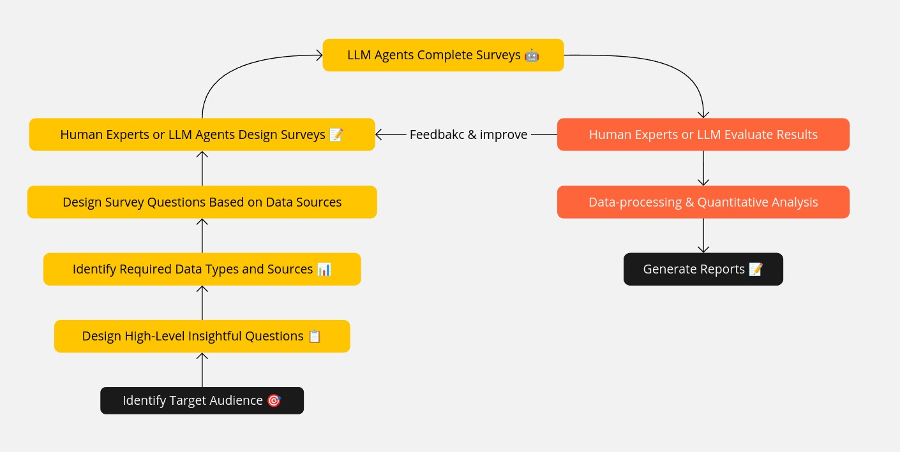

# Code-Survey: Uncovering Insights in Large-Scale Codebases with LLM

- Do we truly understand how complex systems, like the Linux kernel, work? 
- How can we grasp the high-level design choices and evolution of such intricate systems?

**Code-Survey** is the first step in using LLMs to gain meaningful insights into large-scale software systems. Unlike Retrieval-Augmented Generation (RAG) or fine-tuning, Code-Survey offers a unique approach.

> Imagine if every entry-level kernel developer or a graduate student studying the kernel， could participate in a survey about every commit. What valuable information could we uncover from the results?

Code-Survey helps you explore and analyze some of the world's largest and most complex codebases, such as the Linux kernel. By carefully **designing a survey** and **transforming** unstructured data like commits and emails into organized, structured, and easy-to-analyze formats, you can perform quantitative analysis with ease. Code-Survey simplifies the process of uncovering valuable insights in modern complex software systems.

**See our arxiv for details: [https://arxiv.org/abs/2410.01837](https://arxiv.org/abs/2410.01837)**

Here is an example of analysis for the eBPF subsystem: **[docs/report_ebpf.md](docs/report_ebpf.md).** (Not yet complete...more is adding)

## Why Code-Survey?

As far as we know, Code-Survey is the first method and tool that leverages LLMs to systematically explore and analyze large-scale codebases, providing quantitative results. By transforming unstructured data like git messages and emails into structured data, you can perform detailed analyses on software evolution, uncovering insights related to design, implementation, maintenance, reliability, and security.

Software development is also a social activity, allowing the application of established social science techniques. By treating LLMs as human participants in a survey, Code-Survey bridges the gap between high-level design decisions and the intricate details of implementation. This enables the analysis of large-scale codebases like the Linux kernel in ways that were previously impossible.

### Why Choose Code-Survey?

- **Unprecedented Analysis**: No human can analyze large-scale codebases as thoroughly as AI can.
- **No Chatbots or RAG**: Forget about chatbots, RAG document searches, or code generation. **Stop the ineffective AI!**
- **Simple and Flexible**: Use only data like git messages and email data. Design a survey and run it with just a few lines of Python code. Easily apply Code-Survey to other projects or subsystems by designing your own code-survey.

**Let's do Code-Survey!**

Join us in revolutionizing the way we understand and analyze complex software systems.

## What Questions Can Code-Survey Help Answer?

- How do new feature introductions impact the stability and performance of existing components over time?
- What are the identifiable phases in a component's lifecycle (e.g., development, stabilization, optimization)?
- How have specific features evolved over successive commits?
- Which components or files have the highest bug frequency?
- What dependencies have emerged between features and components?
- How can lessons from the development history of one subsystem improve others?

## Workflow / Methodolog

The core idea of Code-survey is to treat LLMs like human participants in a survey: 

- they can process data faster and cheaper, but are also prone to errors and limitations. 
- By applying traditional human survey methods, we can efficiently conduct LLM-based surveys, while human experts provide oversight and validation to ensure accuracy.
- You can let LLM help you with survey design and data 



Our approach follows a well-defined workflow:

1. **Human Experts or LLM Agents design surveys**: Tailored questions for each unstructured data type (e.g., commits, emails) to extract key information.
2. **LLM Agents complete the surveys**: Answering yes/no, tagging relevant data, and summarizing key information. **This is the key steps to turn unstructured data into structured data.**
3. **Human Experts or LLM Agents analysis results**: Ensuring accuracy and uncover new insights easily from that. If the results are not statisfied, go back to step 1 to enhance the survey.
4. **Generate Reports**: Summarize the results and provide insights into the data.

There are also 4 key steps to allow LLM Agent asistant to design the survey. The workflow and prompts are like:

1. **Identify the target audience and their roles**: If you can ask every kernel developer to do a completed survey/questionare about a commit/a mail, what kinds of people may be intereted in it? Describe the roles in detail.
2. **Designing High Level insightful questions based on the roles**: What are the most insightful questions related to `design`, `implementation`, `maintenance`, `reliability` and `security` of {role} may be interested in? Describe the questions for each role in detail.
3. **Identify the required data types and sources for the insightful questions**: What are the data types and sources required to answer the insightful question {Your question} your descirbed before? Describe the data types and sources for each question in detail.
4. **Design the survey questions to get the data:** What are the survey questions you can design to get the {data type} for the insightful question {Your question} from {data source} your descirbed before? Describe the survey questions for {data source} * {data type} in detail.

## Linux-bpf Dataset

The **Linux-bpf dataset** focuses on the eBPF subsystem and is continuously updated via CI. The dataset includes:

- **680+ expert-selected commits**: Features, commit details, types (Map, Helper, Kfunc, Prog, etc.). Human experts tagged these commits and can be analyzed by LLM Agents. [dataset here](data/feature_commit_details.csv)
- **12,000+ BPF-related commits**: LLM Agent surveys and summaries. You can download [dataset here](data/commit_survey.csv).
- **150,000+ BPF subsystem-related emails**: LLM Agent surveys and summaries(`TODO`).

**To see more details abot what we find, check the analysis in [report_ebpf.md](docs/report_ebpf.md).**

A simplest approach to see how these data works is just **Upload the CSV to ChatGPT**(**Or other platforms) and Ask questions to let it Analysis for you!

Note this is just a very simple demo now --- there are hundreds of ways to improve the survey accuracy:

- It's using gpt4o API, o1 model can be much better;
- You can simply run it multiple times to get multiple survey results and then average them. This is typically a real survey d and the result would be much better, but we need time and more money for API.
- More Advance Agent design with multi-steps and reasonging, or multi-agent;
- Better prompt engineering;

## Survey Example

You can find this example in [survey/commit_survey.yml](survey/commit_survey.yml), which analysis all the 10000+ bpf commits in the Linux kernel eBPF subsystem.

```yml
title: "Commit Classification Survey"
description: "A survey about the commit in Linux eBPF, to help better understand the design and evolution of bpf subsystem. For choice, try to be as specific as possible based on the commit message and code changes. If the commit message is not clear or does not provide enough information, you can choose the 'I'm not sure' option."
hint: "For example, when seems not related to eBPF, confirm it's a rare cases really has nothing to do with eBPF in all it's contents, such as btrfs or misspelled commit message. Do not tag subsystem changes related to eBPF as not."
questions:
- id: summary
  type: fill_in
  question: "Please provide a summary of It in one short sentence not longer than 30 words. Only output one sentence."
  required: true

- id: keywords
  type: fill_in
  question: "Please extract no more than 3 keywords from the commit. Only output 3 keywords without any special characters."
  required: true

- id: commit_classification
  type: single_choice
  question: "What may be the main type of the commit?"
  choices:
    - value: A bug fix. It primarily resolves a bug or issue in the code.
    - value: A new feature. It adds a new capability or feature that was not previously present.
    - value: A performance optimization. It improves the performance of existing code such as reducing latency or improving throughput.
    - value: A cleanup or refactoring in the code. It involves changes to improve code readability maintainability or structure without changing its functionality.
    - value: A documentation change or typo fix. It only involves changes to documentation files or fixes a typographical error.
    - value: A test case or test infrastructure change. It adds or modifies test cases test scripts or testing infrastructure.
    - value: A build system or CI/CD change. It affects the build process continuous integration or deployment pipelines.
    - value: A security fix. It resolves a security vulnerability or strengthens security measures.
    - value: It's like a merge commit. It merges changes from another branch or repository.
    - value: It's other type of commit. It does not fit into any of the categories listed above.
    - value: I'm not sure about the type of the commit. The nature of It is unclear or uncertain.

- id: major_related_implementation_component
  type: single_choice
  question: "What major implementation component is modified by the commit? It's typically where the code changes happened."
  choices:
    - value: The eBPF verifier. This component ensures that eBPF programs are safe to run within the kernel.
    - value: The eBPF JIT compiler for different architectures. It changes how eBPF bytecode is translated into machine code for different hardware architectures.
    - value: The helper and kfuncs. It modifies or adds helpers and kernel functions that eBPF programs can call.
    - value: The syscall interface. It changes the system calls through which user-space programs interact with eBPF.
    - value: The eBPF maps. It changes how data structures shared between user-space and kernel-space (maps) are created or managed.
    - value: The libbpf library. It affects the library that simplifies interaction with eBPF from user-space applications.
    - value: The bpftool utility. It modifies the bpftool utility used for introspecting and interacting with eBPF programs and maps.
    - value: The test cases and makefiles. It adds or modifies test cases or makefile scripts used for testing or building eBPF programs.
    - value: The implementation happens in other subsystem and is related to eBPF events. e.g. probes perf events tracepoints network scheduler HID LSM etc. Note it's still related to how eBPF programs interact with these events. 
    - value: It's like a merge commit. It includes significant changes across multiple components of the system.
    - value: It's not related to any above. It affects an implementation component not listed but does related to the BPF subsystem.
    - value: It's not related to any above. It affects an implementation component is totally unrelated to the BPF subsystem.  It's not related to any above because it totally not related to the BPF subsystem. It's a rare case wrong data and need removed.
    - value: I'm not sure about the implementation component of the commit. The component affected by It is unclear.
......
```

### run the survey example

There are two examples to run the survey:

- [survey/survey_agent.py](survey/survey_agent.py) is a simple script to run the [survey/feature_survey.yml](survey/feature_survey.yml) survey, which works on the feature_commit_details.csv dataset. It try to answer questions one at a time.
- [survey/survey_struct.py](survey/survey_struct.py) is a simple script to run the [survey/commit_survey.yml](survey/commit_survey.yml) survey, which works on the commit_survey.csv dataset. It's using struct output and try to answer all questions at once. It will also revise the survey result to make it more accurate. 

They are just simple scripts, you can set the `OPENAI_API_KEY` in the `.env` file to run it.

## Why LLM?

LLMs have been proven effective in survey, summarization, and analysis tasks in fields like market research and chemistry. With LLMs, we can analyze unstructured data, which traditional methods struggle to handle efficiently. 

### Why Not Other Methods? Why human experts can't?

- **Domain Knowledge**: Required for Linux kernel analysis Domain Knowledge. Just use keyword search or simple NLP tools can't handle that.
- **Unstructured Data**: Commit messages and emails are difficult to process with traditional tools.
- **Expert Cost**: Manually analyzing this data is time-consuming and expensive. **It's impossible to do that for the whole Linux kernel commits.**
Here’s a focused version emphasizing **Designing Questions** and **Using Statistical Methods** for ensuring correctness and consistency:

### How to Make Sure the Result is Correct and Meaningful?

- **Design Questions for Correctness**: Create well-structured, specific questions that minimize ambiguity. Design questions to compare similar features, commits, or components across different contexts, which helps identify inconsistencies and errors in the results.
- **Cross-Check with Known Data**: Ensure that the questions target areas where the answers can be validated with reliable sources like commit logs, documentation, or expert knowledge, allowing easy verification of correctness.
- **Use Statistical Methods to Ensure Consistency**: Apply statistical tools like variance analysis or correlation checks to spot inconsistencies across different answers. If similar questions yield divergent results, investigate potential errors in data collection or question framing.
- **Detect Anomalies and Outliers**: Statistical analysis can flag unusual or extreme responses that deviate from the norm. Review these outliers to assess whether they highlight real anomalies or potential mistakes in survey logic.
- **Measure Agreement Between Runs**: Use methods like inter-rater reliability or other consistency metrics to compare results across multiple runs of the survey, ensuring consistent responses to repeated questions.

### Best Practices for Designing Surveys:

The key points to consider when designing code-surveys are:

1. Use **pre-defined tags and categories** to structure responses and avoid open-ended questions where LLMs may hallucinate.  
2. Allow LLMs to answer "I don’t know" for unfamiliar questions to prevent incorrect or random responses.  
3. Using **feedback loops, CoT planning** and memory for LLM Agents to review and refine answers multiple times for better accuracy.  
4. Perform **pilot testing** and apply **data validation** to ensure logical consistency and filter out low-quality responses.

For a more detailed explanation and the general approach, see the [docs/best-practice-survey.md](docs/best-practice-survey.md) document.

### Limitations

- **Dependency on Data Quality:** The method relies on complete and well-structured commit data, and incomplete data can obscure analysis.
- **LLM Mistakes:** LLMs, like humans, can misinterpret or hallucinate, but careful survey design can help mitigate these issues.
- **Human Expert Oversight:** Expert involvement is essential for designing effective surveys and interpreting results, which may limit scalability.

### Future Work

1. **Improved Evaluation of LLM-Generated Data:** Develop validation frameworks and benchmarks to improve accuracy in LLM outputs.
2. **Automation and Performance Enhancement:** Automate the process further with advanced models and improve performance for seamless machine analysis.
3. **Application to Other Repositories:** Expand the method to projects like Kubernetes, LLVM, and Apache for scalability and versatility.
4. **Direct Structuring of Code and Functions:** Move beyond commits and mailing lists to structure code and functions into queryable data.
5. **Integration of Additional Data Sources:** Incorporate data from reviews, issue trackers, and documentation to enhance insights into feature evolution.
6. **Ethical and Privacy Considerations:** Focus on anonymization, regulatory compliance, and secure handling of sensitive data.

## Citation

If you find this work useful, please consider citing:

```bibtex
@misc{zheng2024codesurveyllmdrivenmethodologyanalyzing,
      title={Code-Survey: An LLM-Driven Methodology for Analyzing Large-Scale Codebases}, 
      author={Yusheng Zheng and Yiwei Yang and Haoqin Tu and Yuxi Huang},
      year={2024},
      eprint={2410.01837},
      archivePrefix={arXiv},
      primaryClass={cs.SE},
      url={https://arxiv.org/abs/2410.01837}, 
}
```

## References

Linux development:

1. [Submitting patches: the essential guide to getting your code into the kernel](https://www.kernel.org/doc/html/v4.10/process/submitting-patches.html)
2. [how to ask question in maillist](https://www.linuxquestions.org/questions/linux-kernel-70/how-to-ask-question-in-maillist-4175719442/)
3. [How to Communicate When Submitting Patches: An Empirical Study of the Linux Kernel](https://dl.acm.org/doi/abs/10.1145/3359210)
3. [Differentiating Communication Styles of Leaders on the Linux Kernel Mailing List](https://dl.acm.org/doi/abs/10.1145/2957792)

AI model:

- [Introducing OpenAI o1-preview](https://openai.com/index/introducing-openai-o1-preview/) They can reason through complex tasks and solve harder problems than previous models in science, coding, and math.

Understanding the code:

- [Using an LLM to Help With Code Understanding](https://dl.acm.org/doi/abs/10.1145/3597503.3639187)

Software evolution:

- [The Linux kernel as a case study in software evolution](https://www.sciencedirect.com/science/article/pii/S0164121209002519)
- [Challenges in software evolution](https://ieeexplore.ieee.org/abstract/document/1572302)
