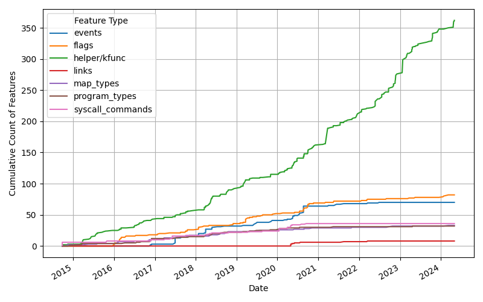
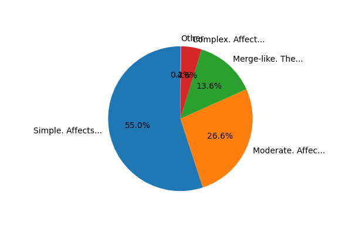
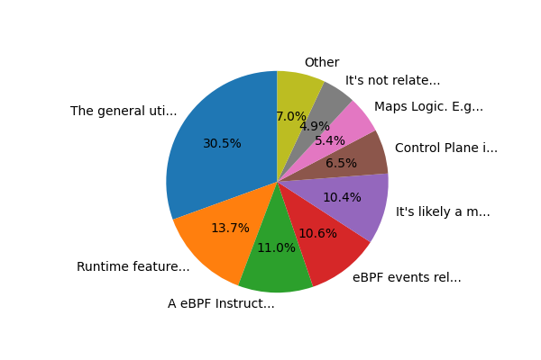
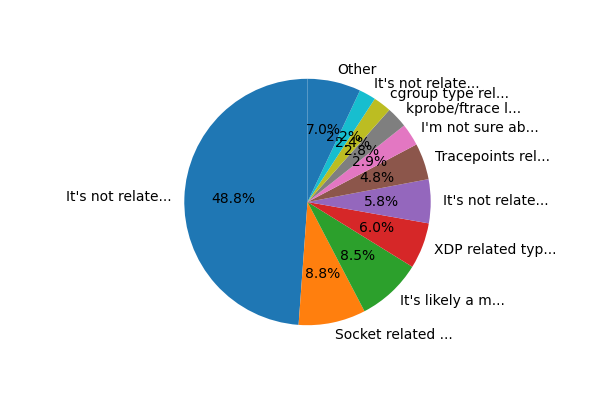
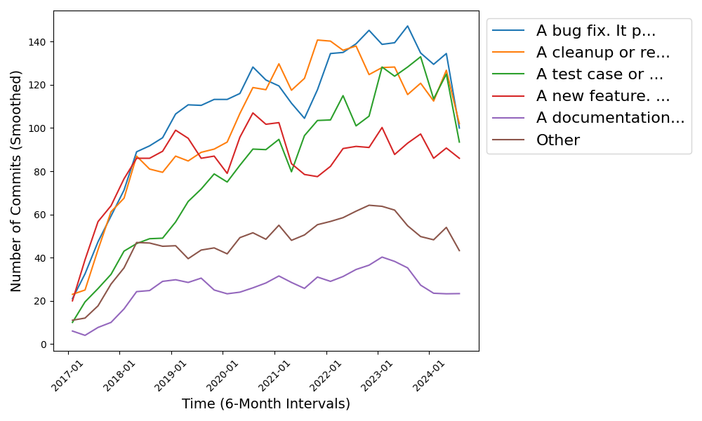
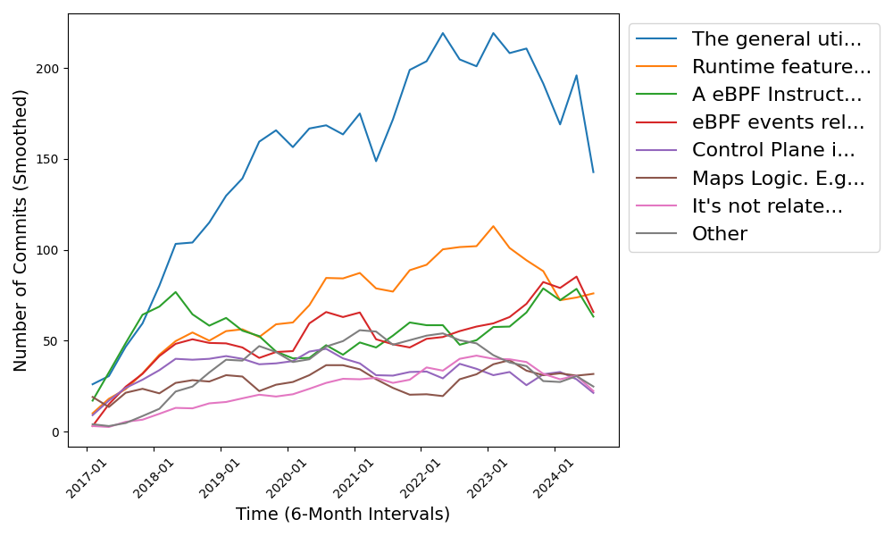
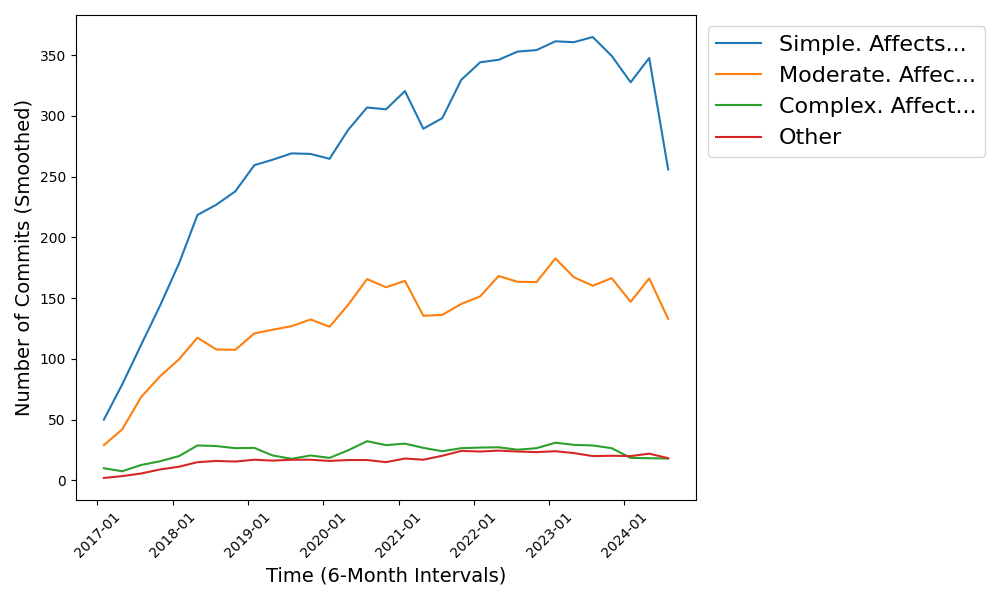
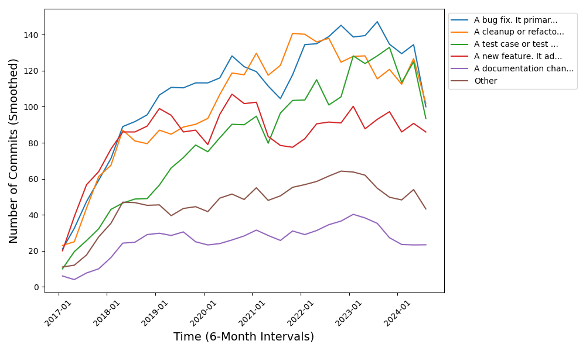

# Case study: eBPF commits and features analysis

In this section, we apply the *Code-survey* methodology to analyze the evolution and development of the eBPF subsystem in the Linux kernel. We aim to uncover deep insights into the lifecycle, stability, and design decisions of key eBPF features. The results generated by the survey are validated through expert review, as well as quantitative and qualitative analysis.

- [Case study: eBPF commits and features analysis](#case-study-ebpf-commits-and-features-analysis)
  - [Motivation: Features in eBPF Kernel with Data Analysis](#motivation-features-in-ebpf-kernel-with-data-analysis)
    - [How do all eBPF features evolve over time?](#how-do-all-ebpf-features-evolve-over-time)
    - [Timeline of eBPF Helper Functions vs. Kernel Functions](#timeline-of-ebpf-helper-functions-vs-kernel-functions)
    - [What are the patterns in other eBPF features?](#what-are-the-patterns-in-other-ebpf-features)
    - [However...](#however)
  - [Example:  Commit Classification Survey Definition](#example--commit-classification-survey-definition)
  - [Analysis commit example](#analysis-commit-example)
  - [The commit dataset](#the-commit-dataset)
  - [Distribution Analysis](#distribution-analysis)
    - [What's the commit types?](#whats-the-commit-types)
    - [What's the commit complexity?](#whats-the-commit-complexity)
    - [What's the major related implementation component?](#whats-the-major-related-implementation-component)
    - [What's the logic feature/component related?](#whats-the-logic-featurecomponent-related)
    - [Is there any related events or usecases?](#is-there-any-related-events-or-usecases)
  - [Correctness of Survey Responses](#correctness-of-survey-responses)
    - [Merge Commit Correctness](#merge-commit-correctness)
    - [Not Related to the BPF Subsystem](#not-related-to-the-bpf-subsystem)
  - [Consistency Across Similar Questions](#consistency-across-similar-questions)
    - [Example 1: Merge Commits](#example-1-merge-commits)
    - [Example 2: Unrelated Components](#example-2-unrelated-components)
  - [The timeline analysis of commits](#the-timeline-analysis-of-commits)
    - [Commit Classification Over Time](#commit-classification-over-time)
    - [Commit related to Major Implementation Component Over Time](#commit-related-to-major-implementation-component-over-time)
    - [Commit related to Major Logic Component Over Time](#commit-related-to-major-logic-component-over-time)
    - [Use cases or events Over Time](#use-cases-or-events-over-time)
    - [Commit Complexity Over Time](#commit-complexity-over-time)
  - [Deeper insights Analysis](#deeper-insights-analysis)
    - [What kernel components has the most frequently bugs?](#what-kernel-components-has-the-most-frequently-bugs)
    - [Verifier bugs or features related to eBPF Instruction](#verifier-bugs-or-features-related-to-ebpf-instruction)
    - [The evolution and status of libbpf](#the-evolution-and-status-of-libbpf)
  - [Coverage of Survey Questions](#coverage-of-survey-questions)
  - [Clarity and Ambiguity in Responses](#clarity-and-ambiguity-in-responses)
  - [Alignment with Real-World Changes](#alignment-with-real-world-changes)
  - [Bias Detection](#bias-detection)
  - [Expert Confirmation](#expert-confirmation)

---

## Motivation: Features in eBPF Kernel with Data Analysis

With **traditional methods** and **well-defined kernel structs**, we can analyze the eBPF kernel feature datasets to study the evolution of various eBPF features, such as helpers, maps, attach types, and other functionalities.

I've obtained the feature pairs from [this GitHub repo](https://github.com/isovalent/ebpf-docs/blob/master/data/feature-versions.yaml), and combined it with git commit data.

### How do all eBPF features evolve over time?

This analysis reveals trends in the adoption of new features, changes in feature popularity, and the impact of feature evolution on the overall eBPF subsystem.



**Key Takeaways:**
1. **Helpers and kfuncs** show the most growth. Helpers are now stable, but kfuncs are growing rapidly.
2. **Others** see steady increases, indicating their maturity.

### Timeline of eBPF Helper Functions vs. Kernel Functions

This timeline analyzes the evolution of eBPF helper functions and their relationship with kernel functions over time. The analysis highlights trends in the adoption of new helper functions and their impact on kernel functionality.


**Key Takeaways:**
1. **Helper functions** are stable, and almost no new helpers are being added.
2. **Kfuncs** are growing very rapidly, showing the community's interest in expanding kernel interaction via kfuncs.
3. All new use cases now tend to use **kfuncs** to influence kernel behavior, signaling a shift towards deeper kernel integrations.

### What are the patterns in other eBPF features?

This analysis examines eBPF feature evolution, excluding helper functions and kernel functions. The focus is on core eBPF features and their impact on the overall subsystem.


**Key Takeaways:**
1. **Core features** like events, flags, map types, and program types have stabilized.
2. The time when **bpf_link** is introductioned, kernel maintainers start to manage growing use cases and complexity so other components, like maps and flags, maintain a stable growth trajectory.

To reproduce these results, you can run the following commands:

```bash
python analysis/bpf/timeline_helper_vs_kfunc.py
python analysis/bpf/timeline_link_attach.py
python analysis/bpf/timeline_features.py
python analysis/bpf/timeline_without_helper.py
```

### However...

The analysis of eBPF features mainly relies on structured definitions and data sources obtain by human, which is limited by the availability of data, and also the time-consuming process of manual data collection and analysis.

There are massive amounts of unstructured data in the form of commit messages, code changes, and developer discussions that can provide valuable insights into the evolution and design decisions of eBPF features. As a human, you can do some Emperical analysis on some of them, but covering all of them is `impossible`.

- Can AI help with us? 
- Stoping letting stupid LLM do kernel coding or Just use RAG or funeturned to give wrong answers. Let's try another quantitative apporach.

By carefully designing a `survey`, and using LLM to `transform` `unstructured data` like commits, mails into `well organized, structured and easy-to-analyze data`, then you can do **quantitative** analysis on it with traditional methods. Then AI can help you analyze data and give answers quickly, it's already a feature of ChatGPT.

## Example:  Commit Classification Survey Definition

This survey focuses on commits within the Linux eBPF subsystem to gain insights into the design and evolution of BPF. It evaluates specific aspects of each commit by analyzing the commit message and code changes. The survey allows the selection of the "I'm not sure" option if the information provided in the commit message is insufficient for a definitive classification.

**Key Questions**:

1. **Summary**: Respondents are asked to provide a concise summary (within 30 words) of the commit.
2. **Keywords**: Extract up to three keywords from the commit to capture its essence.
3. **Commit Classification**: Classify the commit into categories like bug fix, new feature, performance optimization, refactoring, documentation changes, or test changes. It also includes options for security fixes, build system changes, merge commits, and cases where the classification is unclear.
4. **Commit Complexity**: Estimate the complexity of the commit based on the scope and impact of the changes, from simple to merge-like commits or auto-generated changes.
5. **Major Related Implementation Component**: Identify the primary implementation component affected, such as the eBPF verifier, JIT compiler, syscall interface, helper functions, maps, libbpf, bpftool, or test cases. Also, there are options for changes happening in other subsystems but related to eBPF events or non-eBPF-related changes.
6. **Major Related Logic Component**: Assess the logic component affected by the commit, such as eBPF instruction logic, program logic, runtime features, control plane interface, or BPF Type Format (BTF). Options also exist for merge commits or unrelated logic components.
7. **Use Cases or Submodule Events**: Evaluate the eBPF use cases or subsystem events the commit may relate to, including XDP, socket-level events, tc, Netfilter, tracepoints, probes, and other hooks in subsystems like scheduler or security modules.

The survey helps classify and analyze the complexity, logic, and implementation components involved in Linux eBPF commits. It also highlights patterns and trends in the evolution of the subsystem.

Survey definition:

```yaml
title: "Commit Classification Survey"
description: "A survey about the commit in Linux eBPF, to help better understand the design and evolution of bpf subsystem. For choice, try to be as specific as possible based on the commit message and code changes. If the commit message is not clear or does not provide enough information, you can choose the 'I'm not sure' option."
hint: "For example, when seems not related to eBPF, confirm it's a rare cases really has nothing to do with eBPF in all it's contents, such as btrfs or misspelled commit message. Do not tag subsystem changes related to eBPF as not."
questions:
- id: summary
  type: fill_in
  question: "Please provide a summary of It in one short sentence not longer than 30 words. Only output one sentence."
  required: true

- id: keywords
  type: fill_in
  question: "Please extract no more than 3 keywords from the commit. Only output 3 keywords without any special characters."
  required: true

- id: commit_classification
  type: single_choice
  question: "What may be the main type of the commit?"
  choices:
    - value: A bug fix. It primarily resolves a bug or issue in the code.
    - value: A new feature. It adds a new capability or feature that was not previously present.
    - value: A performance optimization. It improves the performance of existing code such as reducing latency or improving throughput.
    - value: A cleanup or refactoring in the code. It involves changes to improve code readability maintainability or structure without changing its functionality.
    - value: A documentation change or typo fix. It only involves changes to documentation files or fixes a typographical error.
    - value: A test case or test infrastructure change. It adds or modifies test cases test scripts or testing infrastructure.
    - value: A build system or CI/CD change. It affects the build process continuous integration or deployment pipelines.
    - value: A security fix. It resolves a security vulnerability or strengthens security measures.
    - value: It's like a merge commit. It merges changes from another branch or repository.
    - value: It's other type of commit. It does not fit into any of the categories listed above.
    - value: I'm not sure about the type of the commit. The nature of It is unclear or uncertain.

- id: commit_complexity
  type: single_choice
  question: "What is the estimated complexity of implementing this commit considering file and line changes? Note that complexity is most about the impact of the changes. line changes is just a reference."
  choices:
    - value: Simple. Affects 1-20 lines or across 1-2 files. Typically involves minor bug fixes or small refactoring tasks. requiring minimal configuration or understanding of the system.
    - value: Moderate. Affects 21-100 lines or across a few files (up to 3-4). Involves adding or modifying features or making structural changes that require some system knowledge.
    - value: Complex. Affects more than 100 lines or across 5 or more files. Involves significant changes such as adding new subsystems or refactoring core components requiring deep system knowledge.
    - value: Merge-like. The commit merges multiple branches or contains changes that affect various features or components. making it broader than a typical feature or bug fix.
    - value: Non-code or generated. The changes involve auto-generated code or dependency updates or large formatting commits. which may affect many lines but do not reflect typical code complexity.
    - value: I'm not sure about the complexity of the commit. It is difficult to estimate the complexity based on the provided commit details.

- id: major_related_implementation_component
  type: single_choice
  question: "What major implementation component is modified by the commit? It's typically where the code changes happened."
  choices:
    - value: The eBPF verifier. This component ensures that eBPF programs are safe to run within the kernel.
    - value: The eBPF JIT compiler for different architectures. It changes how eBPF bytecode is translated into machine code for different hardware architectures.
    - value: The helper and kfuncs. It modifies or adds helpers and kernel functions that eBPF programs can call.
    - value: The syscall interface. It changes the system calls through which user-space programs interact with eBPF.
    - value: The eBPF maps. It changes how data structures shared between user-space and kernel-space (maps) are created or managed.
    - value: The libbpf library. It affects the library that simplifies interaction with eBPF from user-space applications.
    - value: The bpftool utility. It modifies the bpftool utility used for introspecting and interacting with eBPF programs and maps.
    - value: The test cases and makefiles. It adds or modifies test cases or makefile scripts used for testing or building eBPF programs.
    - value: The implementation happens in other subsystem and is related to eBPF events. e.g. probes perf events tracepoints network scheduler HID LSM etc. Note it's still related to how eBPF programs interact with these events. 
    - value: It's like a merge commit. It includes significant changes across multiple components of the system.
    - value: It's not related to any above. It affects an implementation component not listed but does related to the BPF subsystem.
    - value: It's not related to any above. It affects an implementation component is totally unrelated to the BPF subsystem.  It's not related to any above because it totally not related to the BPF subsystem. It's a rare case wrong data and need removed.
    - value: I'm not sure about the implementation component of the commit. The component affected by It is unclear.

- id: major_related_logic_component
  type: single_choice
  question: "What major logic component is affected by the commit? Logic component is different from implementation component. it's typically related to the feature. For example a instruction logic change may affect JIT and verifier."
  choices:
    - value: A eBPF Instruction Logic. E.g. It changes how eBPF instructions are interpreted validated or executed by the eBPF virtual machine in the kernel.
    - value: Runtime features Logic. E.g. It modifies how runtime features such as helpers kfuncs interact with kernel component or the runtime configurations.
    - value: eBPF events related Logic. E.g. It changes how events like XDP socket tc or tracing events like tracepoint profile k/uprobe or others like HID schedule LSM attached or affect eBPF programs.
    - value: Control Plane interface Logic. E.g. It modifies the interface through which user-space programs control or interact with eBPF in the kernel.
    - value: Maps Logic. E.g. It changes how eBPF maps are created accessed or managed by both user-space and kernel-space.
    - value: BPF Type Format (BTF) Logic. E.g. It affects BTF which is used for CO-RE (Compile Once Run Everywhere) capabilities or changes how BPF programs interact with the verifier using BTF.
    - value: It's likely a merge commit. E.g. It involves changes across multiple logic components or is related to merging branches.
    - value: The general utilities Logic. E.g. It modifies the tools scripts or code used for building testing config or debugging eBPF.
    - value: It's not related to any above. E.g. It affects a logic component in eBPF that is not listed here and not related to other events.
    - value:  It's not related to any above because it totally not related to the BPF subsystem. The affected componenet and message has no interaction with BPF subsystem at all. It's a rare case wrong data and need removed.
    - value: I'm not sure about the logic component of the commit. The affected logic component is unclear.

- id: usecases_or_submodule_events
  type: multiple_choice
  question: "What major eBPF use cases events or hooks in other subsystems may the commit relate to and be designed for? Note a lot of the commits happend in other subsystems. e.g. perf event. networks. scheduler. But it's still related to how eBPF programs interact with these events. You need to think and seleted the right use cases or events related to the commit, if not applied, seleted"
  choices:
    - value: XDP related type programs. It relates to programs handling high-performance packet processing through the XDP framework.
    - value: Socket related type programs. It relates to programs that process socket-level events such as filtering or manipulating socket traffic.
    - value: tc related type programs. It affects programs managing traffic control (tc) for queuing or prioritizing network traffic.
    - value: Netfilter related type programs. It impacts programs interacting with the Netfilter framework used in packet filtering and NAT.
    - value: Tracepoints related type programs. It modifies programs that attach to tracepoints for low-level kernel event tracing.
    - value: kprobe/ftrace like type kernel dynamic probe programs. It affects kernel-level probes used for tracing kernel functions. It can be other kernel probes in perf-events.
    - value: uprobe/usdt like type user-space dynamic probe programs. It impacts user-space probes for tracing user-space applications. It can be other user-space probes in perf-events.
    - value: Profile related type programs. It affects programs used for profiling system or application performance.
    - value: LSM type related programs. It relates to eBPF programs used with Linux Security Modules (LSMs) for security enhancements.
    - value: Struct_ops type related programs. It affects programs tha t allows user-defined methods to be called by subsystems.
    - value: cgroup type related programs. It affects programs managing resource limits or network behavior via control groups (cgroups).
    - value: HID driver related type programs. It relates to programs interacting with HID (Human Interface Devices) for input/output events.
    - value: Scheduler related type programs. It modifies programs that interact with kernel-level scheduling mechanisms.
    - value: It's not related to any above because it improves the overall eBPF infrastructure. It enhances core infrastructure components like the verifier btf or runtime.
    - value: It's likely a merge commit. It involves changes across multiple use cases or events.
    - value: It's not related to any above because it's other type of use cases or BPF programs related to the BPF subsystem but not listed here.
    - value: It's not related to any above because it totally not related to the BPF subsystem. The affected componenet and message has no interaction with BPF subsystem at all. It's a rare case wrong data and need removed.
    - value: I'm not sure about the use cases or events of the commit. The relationship between It and specific use cases or events is unclear.
```

The complete survey definition and questions are in [survey/commit_survey.yml](survey/commit_survey.yml)

## Analysis commit example

The simple code to let LLM doing the commit analysis is in [survey/survey_struct.py](../survey/survey_struct.py). It's just a feedback loop and struct API call. For example, it will collect the data and let AI process the commit like that:

```txt
--------------------
Processing Commit 1/7346 - Commit ID: bc4f0548f683a3d53359cef15f088d2d5bb4bc39
Survey Title: Commit Classification Survey


Description: A survey about the commit in Linux eBPF, to help better understand the design and evolution of bpf subsystem. For choice, try to be as specific as possible based on the commit message and code changes. If the commit message is not clear or does not provide enough information, you can choose the 'I'm not sure' option.

Commit Details:
  Commit ID: bc4f0548f683a3d53359cef15f088d2d5bb4bc39
  Author Name: Yonghong Song
  Author Email: yhs@fb.com
  Commit Date: 1595363186
  Commit Message:
    bpf: Compute bpf_skc_to_*() helper socket btf ids at build time  Currently, socket types (struct tcp_sock, udp_sock, etc.) used by bpf_skc_to_*() helpers are computed when vmlinux_btf is first built in the kernel.  Commit 5a2798ab32ba ("bpf: Add BTF_ID_LIST/BTF_ID/BTF_ID_UNUSED macros") implemented a mechanism to compute btf_ids at kernel build time which can simplify kernel implementation and reduce runtime overhead by removing in-kernel btf_id calculation. This patch did exactly this, removing in-kernel btf_id computation and utilizing build-time btf_id computation.  If CONFIG_DEBUG_INFO_BTF is not defined, BTF_ID_LIST will define an array with size of 5, which is not enough for btf_sock_ids. So define its own static array if CONFIG_DEBUG_INFO_BTF is not defined.  Signed-off-by: Yonghong Song <yhs@fb.com> Signed-off-by: Alexei Starovoitov <ast@kernel.org> Link: https://lore.kernel.org/bpf/20200720163358.1393023-1-yhs@fb.com
  Changed Files: include/linux/bpf.h |  4 ----; kernel/bpf/btf.c    |  1 -; net/core/filter.c   | 49 ++++++++++++++++++-------------------------------; 3 files changed, 18 insertions(+), 36 deletions(-)
  Parent Hashes: e4d9c2320716ea0e9ef59f503ddd8f253a642ddd
- Please provide a summary of It in one short sentence not longer than 30 words. Only output one sentence.

- Please extract no more than 3 keywords from the commit. Only output 3 keywords without any special characters.

- What may be the main type of the commit?

- What is the estimated complexity of implementing this commit considering file and line changes? Note that complexity is most about the impact of the changes. line changes is just a reference.

- What major implementation component is modified by the commit? It's typically where the code changes happened.

- What major logic component is affected by the commit? Logic component is different from implementation component. it's typically related to the feature. For example a instruction logic change may affect JIT and verifier.

- What major eBPF use cases events or hooks in other subsystems may the commit relate to and be designed for? Note a lot of the commits happend in other subsystems. e.g. perf event. networks. scheduler. But it's still related to how eBPF programs interact with these events. You need to think and seleted the right use cases or events related to the commit, if not applied, seleted

old content:
{
  "summary": "The commit optimizes BPF by computing BPF socket helper IDs at build time, reducing runtime overhead and simplifying the kernel implementation.",
  "keywords": "BPF, build-time, btf_ids",
  "commit_classification": "A performance optimization. It improves the performance of existing code such as reducing latency or improving throughput.",
  "commit_complexity": "Moderate. Affects 21-100 lines or across a few files (up to 3-4). Involves adding or modifying features or making structural changes that require some system knowledge.",
  "major_related_implementation_component": "The helper and kfuncs. It modifies or adds helpers and kernel functions that eBPF programs can call.",
  "major_related_logic_component": "Runtime features Logic. E.g. It modifies how runtime features such as helpers kfuncs interact with kernel component or the runtime configurations.",
  "usecases_or_submodule_events": [
    "Socket related type programs. It relates to programs that process socket-level events such as filtering or manipulating socket traffic."
  ]
}
Rethinking...
new content:
{
  "summary": "The commit optimizes BPF by computing BPF socket helper IDs at build time, reducing runtime overhead and simplifying the kernel implementation.",
  "keywords": "BPF, build-time, btf_ids",
  "commit_classification": "A performance optimization. It improves the performance of existing code such as reducing latency or improving throughput.",
  "commit_complexity": "Moderate. Affects 21-100 lines or across a few files (up to 3-4). Involves adding or modifying features or making structural changes that require some system knowledge.",
  "major_related_implementation_component": "The helper and kfuncs. It modifies or adds helpers and kernel functions that eBPF programs can call.",
  "major_related_logic_component": "Runtime features Logic. E.g. It modifies how runtime features such as helpers kfuncs interact with kernel component or the runtime configurations.",
  "usecases_or_submodule_events": [
    "Socket related type programs. It relates to programs that process socket-level events such as filtering or manipulating socket traffic."
  ]
}
--------------------
```

This is just a very simple demo now --- there are hundreds of ways to improve the survey accuracy:

- It's using gpt4o, o1 can be much better;
- You can simply run it multiple times to get multiple survey results and then average them. This is typically a real survey d and the result would be much better, but we need time and more money for API.
- More Advance Agent design with multi-steps and reasonging, or multi-agent;
- Better prompt engineering;

## The commit dataset

You can find the dataset in [data/commit_survey.csv](../data/commit_survey.csv)

- **Overview**: This dataset provides a detailed analysis of Linux kernel commits, including metadata about `authors`, `commit types`, and `commit message`, `timestamps`. It aims to categorize and classify commits to understand their impact on the system, focusing particularly on the eBPF subsystem and related components.
  
- **Fields**:
  - **Commit Metadata**: Unique IDs, author, and committer details with timestamps.
  - **Commit Messages**: Short descriptions of the changes introduced in each commit.
  - **Classification**: Categories like merge commits, bug fixes, or feature additions.
  - **Complexity**: Level of complexity based on file and line changes.
  - **Components**: Major affected implementation and logic components.
  - **Use Cases**: Related subsystems and modules affected.

All the following analysis is based on this dataset. with `10000+` commits.

## Distribution Analysis

Let's first compute and display the distribution of the commit classification, complexity, major implementation components, and logic components across the dataset.

### What's the commit types?


**Analysis and Insights:**

- **Bug Fixes and Cleanups**: The largest portions of the commits are categorized as bug fixes and code cleanups/refactoring. Each of these categories constitutes a significant percentage of the total commits. This indicates a strong emphasis on maintaining code quality and resolving issues within the BPF subsystem.
  
- **Test Infrastructure Changes**: A substantial number of commits are related to test cases and testing infrastructure. This highlights the importance placed on testing and verification in the eBPF development process to ensure robustness and reliability.
  
- **New Features**: Commits that introduce new features also make up a considerable portion of the total. This reflects ongoing efforts to enhance the capabilities of the eBPF subsystem.
  
- **Merge Commits**: Merge commits represent a notable percentage, which is typical in collaborative projects like the Linux kernel, where changes from different contributors are regularly integrated.

### What's the commit complexity?



**Analysis and Insights:**

- **Simple Changes**: The majority of commits are classified as simple, affecting a small number of lines or files. This suggests that most changes are incremental improvements or minor fixes, which are easier to review and integrate.
  
- **Moderate to Complex Changes**: A significant portion of commits are of moderate complexity, involving more substantial changes. There are also complex commits that indicate significant enhancements or overhauls requiring deep system knowledge.
  
- **Merge-like Commits**: Merge-like commits constitute a significant portion, aligning with the number of merge commits observed earlier. These are broader in scope and integrate changes across multiple components.

### What's the major related implementation component?


**Analysis and Insights:**

- **Test Cases and Makefiles**: A large proportion of commits impact test cases and makefiles. This emphasizes the continuous effort to improve testing frameworks and build processes in eBPF development.
  
- **libbpf Library**: The libbpf library is frequently affected, highlighting its central role in enabling user-space applications to interact with eBPF programs.
  
- **Other Subsystems Related to eBPF Events**: Many commits involve implementations in other subsystems that relate to eBPF events. This indicates active development in integrating eBPF with various kernel components, such as networking or tracing.
  
- **eBPF Verifier and Helpers**: Commits affecting the eBPF verifier and helper functions reflect ongoing enhancements to ensure program safety and expand functionality.

### What's the logic feature/component related?



**Analysis and Insights:**

- **General Utilities Logic**: The most affected logic component is general utilities, including tools and scripts used for building, testing, and debugging eBPF programs. This points to ongoing improvements in the development infrastructure.
- **Runtime Features Logic**: A significant number of commits modify runtime features such as helpers and kernel functions, indicating continuous enhancements to the eBPF runtime environment.
- **eBPF Events Related Logic**: There is substantial activity around logic components related to eBPF events. This shows the dynamic nature of eBPF's integration with system events like network packets or tracepoints.
- **eBPF Instruction Logic**: Commits affecting eBPF instruction logic demonstrate efforts to enhance how eBPF instructions are interpreted, validated, and executed, contributing to the robustness and security of eBPF programs.

### Is there any related events or usecases?



**Analysis and Insights:**

- **Core Infrastructure Enhancements**: The majority of commits improve the overall eBPF infrastructure, such as the verifier, BTF (BPF Type Format), or runtime components.
- **Socket and XDP Programs**: A significant number of commits are related to socket-level and XDP (eXpress Data Path) programs, indicating active development in high-performance networking features.
- **Tracing and Probing**: Commits involving tracepoints, kprobes, and uprobe programs reflect the importance of tracing and debugging capabilities within eBPF.
- **Other Use Cases**: Various commits address use cases like cgroup management, LSM (Linux Security Modules), and HID (Human Interface Devices), showcasing eBPF's versatility in different contexts.

You can simply run the commands to get a text report of the images:

```bash
python analysis/bpf/pie_commits.py
python analysis/bpf/distribution_commits.py
```

## Correctness of Survey Responses

**Question:** How can we ensure that survey responses reflect accurate and relevant information about the system's features and commits?

**Method:** We will select random samples from the survey responses, cross-referencing these with expert knowledge and official documentation, such as commit logs and feature descriptions. This will allow us to verify if the survey accurately captures the intent and impact of specific commits and features.

Some common correctness concerns:

### Merge Commit Correctness

- **Observation:** The percentage of "merge commits" is different between the commit classification perspective (18.83%) and the major related implementation component perspective (13.51%). This raises questions about whether merge commits are consistently classified across different perspectives.

- **Explanation:** This discrepancy occurs because merge commits may affect only a single component. In the commit classification perspective, all merge commits are categorized as such. However, in the implementation component perspective, if a merge commit predominantly affects a specific component, it might be classified under that component instead of being labeled as a merge commit.

For example:

```txt
Top 10 Commit Messages (Merge in Classification but not in Implementation):
3      Merge branch 'bpf-fix-incorrect-name-check-pas...
25     Merge branch 'vsc73xx-fix-mdio-and-phy'  Pawel...
84     Merge branch 'use-overflow-h-helpers-to-check-...
118    Merge branch 'fix-libbpf-bpf-skeleton-forward-...
207    Merge patch series "riscv: Memory Hot(Un)Plug ...
```

- **Conclusion:** The difference in percentages is understandable and can be explained by the classification criteria used in different perspectives. Merge commits that impact a single component are classified based on the component they affect, leading to a lower percentage of merge commits in the implementation component perspective.

### Not Related to the BPF Subsystem

- **Observation:** There are some commits classified as "Not related to the BPF subsystem" in the logic component, and commits classified similarly in the implementation component. This prompts the question of whether these commits are genuinely unrelated to eBPF or if they were misclassified.
- **Explanation:** We are using `--grep=bpf` to filter commits related to the BPF subsystem, which may include commits that mention "bpf" in the commit message but are not directly related to the eBPF subsystem. Additionally, some commits may be peripheral to eBPF or affect other subsystems, leading to their classification as unrelated.

For example:

```txt
Sample Commit Messages of 'Not related to BPF subsystem' in Implementation Component:
17    bonding: fix xfrm real_dev null pointer derefe...
21    btrfs: fix invalid mapping of extent xarray st...
25    Merge branch 'vsc73xx-fix-mdio-and-phy'  Pawel...
35    btrfs: make cow_file_range_inline() honor lock...
```

- **Data Correction:** Unrelated commits can be excluded by refining the filtering criteria after processing and before analysis. Manual review can also help identify and remove irrelevant commits
- **Conclusion:** The presence of commits not related to the BPF subsystem is due to the broad filtering method. By adjusting the filtering approach, we can exclude unrelated data and improve the accuracy of our analysis.

## Consistency Across Similar Questions


- Are similar questions answered consistently across different but related features or subsystems?

Our method involved selecting pairs of closely related questions and comparing the distribution of responses. Specifically, we focused on:

- Commit classifications and their corresponding complexities.
- Major related implementation components and logic components.

We looked for alignment in responses to assess consistency. In cases where inconsistencies were detected, we investigated whether they were contextually justified or indicative of misclassification or survey design flaws.

See the generated `distribute.txt` as example, we have 10000+ commits:

### Example 1: Merge Commits

- **Commit Classification:** "It's like a merge commit." (1,347 responses)
- **Commit Complexity:** "Merge-like. The commit merges branches." (1,346 responses)

Responses were nearly identical, showing high consistency in identifying merge commits.

### Example 2: Unrelated Components

- **Implementation Component:** "Not related to BPF. A rare case of wrong data." (606 responses)
- **Logic Component:** "Not related to BPF. A rare case of wrong data." (602 responses)

The close match (606 vs. 602) indicates consistency in identifying unrelated components.

Given that our dataset comprises over 10,000 commits, the observed discrepancies represent less than `0.05% misclassification` in a single iteration. Such a low rate of inconsistency suggests that the overall data quality is high. Conducting multiple iterations of the survey and averaging the results can further enhance accuracy, minimizing the impact of any outliers or misclassifications.

Our analysis indicates that similar questions are answered consistently across different but related features or subsystems. The consistency observed in the provided examples demonstrates that respondents are reliably interpreting and classifying commits in a uniform manner. While minor inconsistencies exist, they are minimal and do not significantly affect the overall quality of the data. This consistency supports the validity of our survey design and the reliability of the conclusions drawn from the data.

## The timeline analysis of commits

The timeline analysis of commits provides insights into the evolution of the eBPF subsystem over time. By visualizing the distribution of commit types, complexities, and major components across different periods, we can identify trends and patterns in the development of eBPF features.

In this step, we:

1. clean the data and removed any irrelevant commits.
2. Smooth the data and show Avg in 3M to reduce noise and highlight long-term trends.
3. `Merge` commits related to single ccomponent are treated as regular commits. `Merge` commits across multiple ccomponent are removed(like mainline merge). and the y xis is the commit count(May be able to improve)

### Commit Classification Over Time




### Commit related to Major Implementation Component Over Time


### Commit related to Major Logic Component Over Time



### Use cases or events Over Time


### Commit Complexity Over Time



## Deeper insights Analysis

In this section, we will delve deeper into the survey responses to identify patterns, trends, and potential areas for improvement.

### What kernel components has the most frequently bugs?  

By analyzing the survey responses related to the eBPF verifier, we can gain insights into the prevalence of bugs and features related to the instruction set.


### Verifier bugs or features related to eBPF Instruction

By analyzing the survey responses related to the eBPF verifier, we can gain insights into the prevalence of bugs and features related to the instruction set.


### The evolution and status of libbpf

What identifiable phases exist in a component lifecycle, such as libbpf?



## Coverage of Survey Questions

**Question:** Do the survey questions comprehensively cover all relevant aspects of the feature or subsystem under analysis?

**Approach:** We plan to review the survey’s coverage to identify potential gaps, ensuring that important aspects such as security, performance, and dependencies are addressed.

**Method:** We will collaborate with domain experts to validate that the survey covers all critical aspects. Experts will review the survey structure and provide feedback on areas that may be under-explored, such as undocumented features or system performance bottlenecks.

## Clarity and Ambiguity in Responses

**Question:** Are the survey responses clear and unambiguous, making them actionable for further analysis?

**Approach:** We plan to assess the clarity of the survey responses by checking whether they provide unambiguous and actionable insights.

**Method:** Expert reviews will be conducted on a sample of the survey responses to identify any vague or unclear answers. We will then revise any survey questions that are prone to misinterpretation or ambiguity to improve clarity and precision.

## Alignment with Real-World Changes

**Question:** How accurately do survey results reflect real-world changes in the software’s features and evolution?
**Approach:** We plan to compare survey responses with real-world events, such as kernel releases, new features, or deprecations, to ensure that the survey captures the correct historical context.
**Method:** We will cross-reference survey results with commit histories, mailing list discussions, and kernel release notes to verify alignment with real-world changes. Any discrepancies will be analyzed to refine the survey.

## Bias Detection

**Question:** Are the survey responses biased toward certain types of questions or features?
**Approach:** We plan to evaluate whether certain types of questions or features receive disproportionately higher or lower accuracy in survey responses, potentially indicating bias.
**Method:** We will analyze the distribution of correctness across various question types and feature categories, identifying patterns of bias. If biases are detected, we will adjust the survey design to mitigate these issues.

## Expert Confirmation

**Question:** How do experts rate the accuracy of the survey's generated insights?
**Approach:** We plan to gather feedback from domain experts to confirm the accuracy and usefulness of the survey insights.
**Method:** We will provide experts (e.g., kernel maintainers) with a sample of survey responses and ask them to rate the accuracy of each response on a defined scale. Based on their feedback, we will refine the survey to improve its correctness and relevance.
